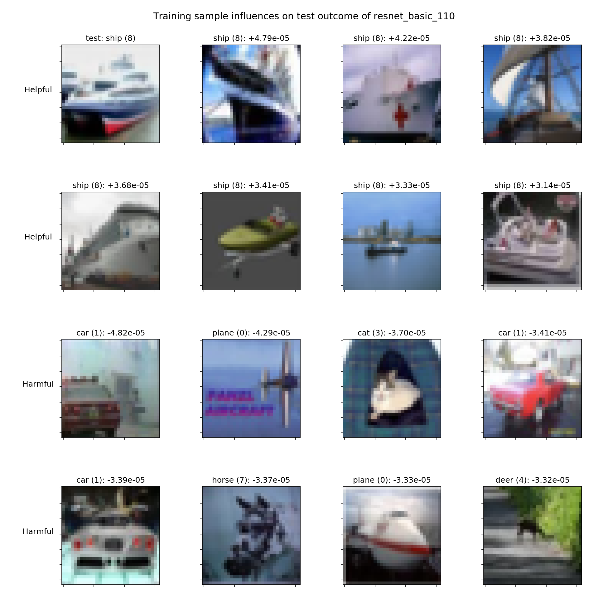
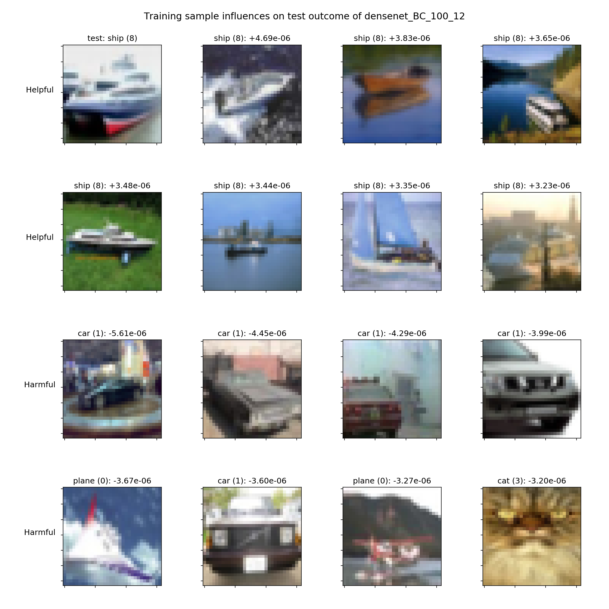

# Influence Functions for PyTorch

This is a PyTorch reimplementation of Influence Functions from the ICML2017 best paper:
[Understanding Black-box Predictions via Influence Functions](https://arxiv.org/abs/1703.04730) by Pang Wei Koh and Percy Liang.
The reference implementation can be found here: [link](https://github.com/kohpangwei/influence-release).

- [Why Use Influence Functions?](#why-use-influence-functions)
- [Requirements](#requirements)
- [Installation](#installation)
- [Usage](#usage)
- [Background and Documentation](#background-and-documentation)
  - [config](#config)
    - [Misc parameters](#misc-parameters)
    - [Calculation parameters](#calculation-parameters)
      - [s_test](#stest)
  - [Modes of computation](#modes-of-computation)
  - [Output variables](#output-variables)
    - [Influences](#influences)
    - [Harmful](#harmful)
    - [Helpful](#helpful)
- [Roadmap](#roadmap)
  - [v0.2](#v02)
  - [v0.3](#v03)
  - [v0.4](#v04)

## Why Use Influence Functions?

Influence functions help you to debug the results of your deep learning model
in terms of the dataset. When testing for a single test image, you can then
calculate which training images had the largest result on the classification
outcome. Thus, you can easily find mislabeled images in your dataset, or
compress your dataset slightly to the most influential images important for
your individual test dataset. That can increase prediction accuracy, reduce
training time, and reduce memory requirements. For more details please see
the original paper linked [here](https://arxiv.org/abs/1703.04730).

Influence functions can of course also be used for data other than images,
as long as you have a supervised learning problem.

## Requirements

* Python 3.6 or later
* PyTorch 1.0 or later
* NumPy 1.12 or later

To run the tests, further requirements are:

* torchvision 0.3 or later
* PIL

## Installation

You can either install this package directly through pip:

```bash
pip3 install --user pytorch-influence-functions
```

Or you can clone the repo and 

* import it as a package after it's in your `PATH`.
* install it using `python setup.py install`
* install it using `python setup.py develop` (if you want to edit the code)

## Usage

Calculating the influence of the individual samples of your training dataset
on the final predictions is straight forward.

The most barebones way of getting the code to run is like this:

```python
import pytorch_influence_functions as ptif

# Supplied by the user:
model = get_my_model()
trainloader, testloader = get_my_dataloaders()

ptif.init_logging()
config = ptif.get_default_config()

influences, harmful, helpful = ptif.calc_img_wise(config, model, trainloader, testloader)

# do someting with influences/harmful/helpful
```

Here, `config` contains default values for the influence function calculation
which can of course be changed. For details and examples, look [here](#config).

## Background and Documentation

The precision of the output can be adjusted by using more iterations and/or
more recursions when approximating the influence.

### config

`config` is a dict which contains the parameters used to calculate the
influences. You can get the default `config` by calling `ptif.get_default_config()`.

I recommend you to change the following parameters to your liking. The list
below is divided into parameters affecting the calculation and parameters
affecting everything else.

#### Misc parameters

* `save_pth`: Default `None`, folder where to save `s_test` and `grad_z` files
  if saving is desired
* `outdir`: folder name to which the result json files are written
* `log_filename`: Default `None`, if set the output will be logged to this
  file in addition to `stdout`.

#### Calculation parameters

* `seed`: Default = 42, random seed for numpy, random, pytorch
* `gpu`: Default = -1, `-1` for calculation on the CPU otherwise GPU id
* `calc_method`: Default = img_wise, choose between the two calculation methods
  outlined [here](#modes-of-computation).
* `DataLoader` object for the desired dataset
  * `train_loader` and `test_loader`
* `test_sample_start_per_class`: Default = False, per class index from where to
  start to calculate the influence function. If `False`, it will start from `0`.
  This is useful if you want to calculate the influence function of a whole
  test dataset and manually split the calculation up over multiple threads/
  machines/gpus. Then, you can start at various points in the dataset.
* `test_sample_num`: Default = False, number of samples per class
  starting from the `test_sample_start_per_class` to calculate the influence
  function for. E.g. if your dataset has 10 classes and you set this value to
  `1`, then the influence functions will be calculated for `10 * 1` test
  samples, one per class. If `False`, calculates the influence for all images.

##### s_test

* `recursion_depth`: Default = 5000, recursion depth for the `s_test` calculation.
  Greater recursion depth improves precision.
* `r`: Default = 1, number of `s_test` calculations to take the average of.
  Greater r averaging improves precision.
* Combined, the original paper suggests that `recursion_depth * r` should equal
  the training dataset size, thus the above values of `r = 10` and
  `recursion_depth = 5000` are valid for CIFAR-10 with a training dataset size
  of 50000 items.
* `damp`: Default = 0.01, damping factor during `s_test` calculation.
* `scale`: Default = 25, scaling factor during `s_test` calculation.

### Modes of computation

This packages offers two modes of computation to calculate the influence
functions. The first mode is called `calc_img_wise`, during which the two
values `s_test` and `grad_z` for each training image are computed on the fly
when calculating the influence of that single image. The algorithm moves then
on to the next image. The second mode is called `calc_all_grad_then_test` and
calculates the `grad_z` values for all images first and saves them to disk.
Then, it'll calculate all `s_test` values and save those to disk. Subsequently,
the algorithm will then calculate the influence functions for all images by
reading both values from disk and calculating the influence base on them. This
can take significant amounts of disk space (100s of GBs) but with a fast SSD
can speed up the calculation significantly as no duplicate calculations take
place. This is the case because `grad_z` has to be calculated twice, once for
the first approximation in `s_test` and once to combine with the `s_test`
vector to calculate the influence. Most importantnly however, `s_test` is only
dependent on the test sample(s). While one `grad_z` is used to estimate the
initial value of the Hessian during the `s_test` calculation, this is
insignificant. `grad_z` on the other hand is only dependent on the training
sample. Thus, in the `calc_img_wise` mode, we throw away all `grad_z`
calculations even if we could reuse them for all subsequent `s_test`
calculations, which could potentially be 10s of thousands. However, as stated
above, keeping the `grad_z`s only makes sense if they can be loaded faster/
kept in RAM than calculating them on-the-fly.

**TL;DR**: The recommended way is using `calc_img_wise` unless you have a crazy
fast SSD, lots of free storage space, and want to calculate the influences on
the prediction outcomes of an entire dataset or even >1000 test samples.

### Output variables

Visualised, the output can look like this:



The test image on the top left is test image for which the influences were
calculated. To get the correct test outcome of _ship_, the Helpful images from
the training dataset were the most helpful, whereas the Harmful images were the
most harmful. Here, we used CIFAR-10 as dataset. The model was ResNet-110. The
numbers above the images show the actual influence value which was calculated.

The next figure shows the same but for a different model, DenseNet-100/12.
Thus, we can see that different models learn more from different images.



#### Influences

Is a dict/json containting the influences calculated of all training data
samples for each test data sample. The dict structure looks similiar to this:

```python
{
    "0": {
        "label": 3,
        "num_in_dataset": 0,
        "time_calc_influence_s": 129.6417362689972,
        "influence": [
            -0.00016939856868702918,
            4.3426321099104825e-06,
            -9.501376189291477e-05,
            ...
        ],
        "harmful": [
            31527,
            5110,
            47217,
            ...
        ],
        "helpful": [
            5287,
            22736,
            3598,
            ...
        ]
    },
    "1": {
        "label": 8,
        "num_in_dataset": 1,
        "time_calc_influence_s": 121.8709237575531,
        "influence": [
            3.993639438704122e-06,
            3.454859779594699e-06,
            -3.5805194329441292e-06,
            ...
```

#### Harmful

Harmful is a list of numbers, which are the IDs of the training data samples
ordered by harmfulness. If the influence function is calculated for multiple
test images, the harmfulness is ordered by average harmfullness to the
prediction outcome of the processed test samples.

#### Helpful

Helpful is a list of numbers, which are the IDs of the training data samples
ordered by helpfulness. If the influence function is calculated for multiple
test images, the helpfulness is ordered by average helpfulness to the
prediction outcome of the processed test samples.

## Roadmap

### v0.2

* [x] makes variable names etc. dataset independent
* [x] remove all dataset name checks from the code
* [ ] ability to disable shell output eg for `display_progress` from the config
* [ ] add proper result plotting support
* [ ] add a dataloader for training on the most influential samples only
* [x] add some visualisation of the outcome
* [ ] add recreation of some graphs of the original paper to verify
  implementation
* [ ] allow custom save name for the influence json

### v0.3

* [ ] make the config a class, so that it can readjust itself, for example
  when the `r` and `recursion_depth` values can be lowered without big impact
* [ ] check killing data augmentation!?
* [ ] in `calc_influence_function.py` in `load_s_test`, `load_grad_z` don't
  hard code the filenames

### v0.4

* [ ] integrate myPy type annotations (static type checking)
* [ ] Use multiprocessing to calc the influence
* [ ] use `r"doc"` docstrings like pytorch
